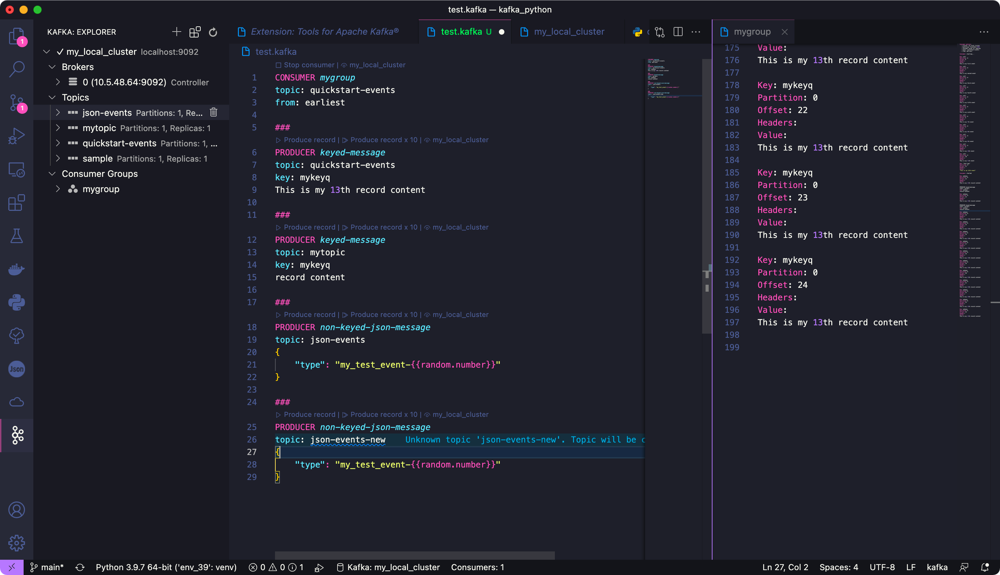
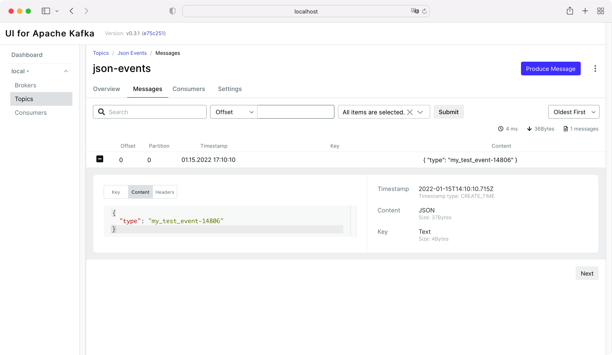
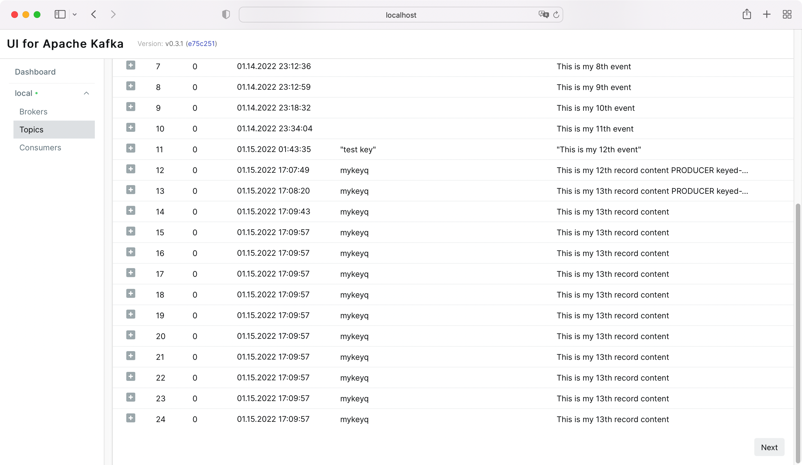

Kafka Python example
====================

I use 2 kafka client libs
- kafka-python (community-version)
- confluent_kafka (fastest, enterprise proven)

Usage
---------
Usually you need to start zookeeper firstly on localhost:2181 for message persistence
Then start a Kafka server on localhost:9092 connected to the zookeeper server.

run `*consumer.py` will subscribe to event `quickstart-events`

run `*producer.py` will produce data sent to event `quickstart-events`.

Hit <key>Ctrl</key>+<key>C</key> to stop.

specially for M1 mac to use confluent_kafka
-----------

Suggest to do this in Python virtualenv.

1) install librdkafka via homebrew

`brew install librdkafka`

2) then install confluent_kafka with librdkafka headers.

`C_INCLUDE_PATH=/opt/homebrew/Cellar/librdkafka/1.8.2/include LIBRARY_PATH=/opt/homebrew/Cellar/librdkafka/1.8.2/lib pip install confluent_kafka`

info: https://developpaper.com/mac-m1-arm-installation-confluent-kafka-error-reporting-solution/

View the Kafka server in realtime
---------------

You can use **Kafdrop** or **Kafka-UI**, I suggest to use **Kafka-UI** because it can create topic and send message from the web admin panel, while **Kafdrop** can't.

Try my docker commands for macOS
`run_kafka-ui.sh` or `run_kafdrop.sh`

Tips using VSCode to create producer and consumer
-------------------

Use Kafka plugin **Tools for Apache Kafka®** in vscode, create producer, create consumer and view them all. Just create a file `test.kafka`

View Kafka service from Kafka-UI

Informative view.